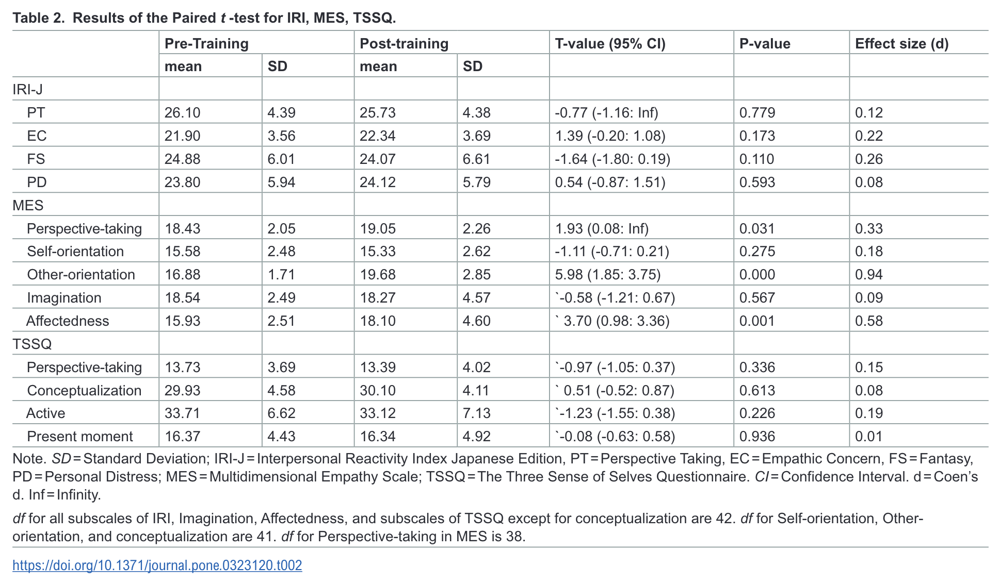

```{r, include=FALSE}
knitr::opts_chunk$set(message = FALSE,
                      warning = FALSE)
```

# Dependencies

```{r}

library(tidyverse)
library(readxl)
library(ggstance)
library(patchwork)
library(broom)
library(janitor)
library(effectsize)
library(knitr)
library(kableExtra)

```

# Get data

```{r}

# data reprocessed from item level data 
data_processed <- read_csv("../data/processed/data_processed.csv") |>
  # select the data after outlier exclusions and then rename the columns for simplicity 
  select(id, ends_with("_outliers_excluded")) |>
  rename_with(~ str_remove(., "_outliers_excluded$"))

# data extracted from table 2 in the article
data_table_2 <- read_xlsx("../data/original/table_2.xlsx") |>
  mutate(scale_subscale = paste(scale, subscale, sep = "_")) |>
  # some rows have upper bounds of Inf as they were one sided tests.
  mutate(upper = ifelse(is.na(upper), Inf, upper))

```

# Table 2 verification

Table 2 reports *t* values and confidence intervals. I suspect these CIs are actually CIs on the difference in means between the conditions. To illustrate this point, I present this data as plots rather than tables. The first plots reported *t* values and CIs and illustrates that the estimate is outside the interval of several of them. The second plots mean differences and CIs and illustrates the mean difference is in the middle of the interval, as would be expected (except for the one sided tests, whose upper limit was Inf).

```{r}

ggplot(data_table_2, aes(t, scale_subscale)) +
  geom_linerangeh(aes(xmin = lower, xmax = upper)) +
  geom_point() +
  theme_linedraw()

ggplot(data_table_2, aes(mean_diff, scale_subscale)) +
  geom_linerangeh(aes(xmin = lower, xmax = upper)) +
  geom_point() +
  theme_linedraw()

```

# Pre-post comparisons

## F test for equal variances

```{r}

tidy_var_test <- function(data, pre, post, name) {
  var.test(pull(data, !!enquo(pre)),
           pull(data, !!enquo(post))) |>
    broom::tidy() |>
    mutate(outcome = name) |>
    select(outcome,
           f = statistic,
           df1 = num.df,
           df2 = den.df,
           p = p.value)
}

res_var <- bind_rows(
  tidy_var_test(data_processed, iri_pt_pre, iri_pt_post, "IRI PT"),
  tidy_var_test(data_processed, mes_perspective_pre, mes_perspective_post, "MES PT"),
  tidy_var_test(data_processed, tssq_perspective_pre, tssq_perspective_post, "TSSQ PT"),
  
  tidy_var_test(data_processed, iri_ec_pre, iri_ec_post, "IRI EC"),
  tidy_var_test(data_processed, iri_fs_pre, iri_fs_post, "IRI FS"),
  tidy_var_test(data_processed, iri_pd_pre, iri_pd_post, "IRI PD"),
  
  tidy_var_test(data_processed, mes_other_pre, mes_other_post, "MES other"),
  tidy_var_test(data_processed, mes_self_pre, mes_self_post, "MES self"),
  tidy_var_test(data_processed, mes_affected_pre, mes_affected_post, "MES affected"),
  tidy_var_test(data_processed, mes_imagination_pre, mes_imagination_post, "MES imagination"),
  
  tidy_var_test(data_processed, tssq_active_pre, tssq_active_post, "TSSQ active"),
  tidy_var_test(data_processed, tssq_conceptualization_pre, tssq_conceptualization_post, "TSSQ conceptualization"),
  tidy_var_test(data_processed, tssq_present_pre, tssq_present_post, "TSSQ present")
) |>
  mutate(var_equal = ifelse(p < .05, FALSE, TRUE))

res_var |>
  mutate(f = round_half_up(f, 2),
         p = round_half_up(p, 4)) |>
  kable() |>
  kable_classic(full_width = FALSE)

```

The original study reported running Welches' t-tests for "Other-orientation, Affectedness, and Imagination subscales of the MES". I reproduce the same conclusions, following the original study's stated analysis. I didn't compare the exact numerical results.

## Paired *t*-tests

### Screenshot of original article's results:

```{r out.width="90%"}



```

The original article found significant *increases* in the following variables:

- MES PT
- MES other
- MES affectedness

### Verification:

Cohen's $d_{z}$ is approximated from the *t*-statistic and df, as in the original publication.

"One-tailed tests were conducted for PT of IRI and Perspective-taking of MES based on the research hypothesis that scores on perspective taking would increase from pre- to post-training." 

```{r}

tidy_t <- function(data, pre, post, var_equal, name, alternative = "two.sided"){
  t.test(pull(data, !!enquo(pre)),
         pull(data, !!enquo(post)),
         alternative = alternative,
         paired = TRUE,
         var_equal = var_equal) |>
    broom::tidy() |>
    mutate(outcome = name,
           hypothesis = alternative,
           var_equal = var_equal) |>
    select(outcome, hypothesis, var_equal, mean_diff_ci_lower = conf.low, mean_diff_ci_upper = conf.high,
           mean_diff = estimate, t = statistic, df = parameter, p = p.value) |>
    # cohen's d_z estimated from the the t and df.
    mutate(d_z = t / sqrt(df + 1))
}

res_t <- bind_rows(
  tidy_t(data_processed, iri_pt_pre, iri_pt_post, var_equal = TRUE, "IRI PT", alternative = "greater"),
  tidy_t(data_processed, mes_perspective_pre, mes_perspective_post, var_equal = TRUE, "MES PT", alternative = "greater"),
  tidy_t(data_processed, tssq_perspective_pre, tssq_perspective_post, var_equal = TRUE, "TSSQ PT"), # , alternative = "greater" - not used in original paper, unclear to me why
  
  tidy_t(data_processed, iri_ec_pre, iri_ec_post, var_equal = TRUE, "IRI EC"),
  tidy_t(data_processed, iri_fs_pre, iri_fs_post, var_equal = TRUE, "IRI FS"),
  tidy_t(data_processed, iri_pd_pre, iri_pd_post, var_equal = TRUE, "IRI PD"),
  
  tidy_t(data_processed, mes_other_pre, mes_other_post, var_equal = FALSE, "MES other"),
  tidy_t(data_processed, mes_self_pre, mes_self_post, var_equal = TRUE, "MES self"),
  tidy_t(data_processed, mes_affected_pre, mes_affected_post, var_equal = FALSE, "MES affected"),
  tidy_t(data_processed, mes_imagination_pre, mes_imagination_post, var_equal = FALSE, "MES imagination"),
  
  tidy_t(data_processed, tssq_active_pre, tssq_active_post, var_equal = TRUE, "TSSQ active"),
  tidy_t(data_processed, tssq_conceptualization_pre, tssq_conceptualization_post, var_equal = TRUE, "TSSQ conceptualization"),
  tidy_t(data_processed, tssq_present_pre, tssq_present_post, var_equal = TRUE, "TSSQ present")
)

res_t |>
  mutate(mean_diff = round_half_up(mean_diff, 2),
         mean_diff_ci_lower = round_half_up(mean_diff_ci_lower, 2),
         mean_diff_ci_upper = round_half_up(mean_diff_ci_upper, 2),
         t = round_half_up(t, 2),
         p = round_half_up(p, 4),
         d_z = round_half_up(d_z, 2)) |>
  kable() |>
  kable_classic(full_width = FALSE)

ggplot(res_t, aes(mean_diff, outcome)) +
  geom_vline(xintercept = 0, linetype = "dotted") +
  ggstance::geom_linerangeh(aes(xmin = mean_diff_ci_lower, xmax = mean_diff_ci_upper)) +
  geom_point() +
  theme_linedraw() +
  scale_color_viridis_d(begin = 0.3, end = 0.7) +
  xlab("Mean change from pre to post") +
  ylab("")

```

Note that upper 95% CIs for MES PT and IRI PT are Inf because these use one-sided tests, as in the original article.

The verification analysis found significant *decreases* in the following variables:

- MES other
- MES affectedness

Note that if the one-sided test had been in the other direction, significant decreases would have been found for the MES PT:

```{r}

tidy_t(data_processed, mes_perspective_pre, mes_perspective_post, var_equal = TRUE, "MES PT", alternative = "less") |>
  mutate(mean_diff = round_half_up(mean_diff, 2),
         t = round_half_up(t, 2),
         p = round_half_up(p, 4),
         d_z = round_half_up(d_z, 2)) |>
  kable() |>
  kable_classic(full_width = FALSE)

```

### N exclusions 

Original article stated "df for all subscales of IRI, Imagination, Affectedness, and subscales of TSSQ except for conceptualization are 42. df for Self-orientation, Other-orientation, and conceptualization are 41. df for Perspective-taking in MES is 38.". 

These were not reproduced for any variable, suggesting that the description of the exclusion strategy supplied by Ooshima was inaccurately applied by me, or inaccurately described, or inaccurately applied in the original article. 

## Comparing means from Table 2 with reverse scored mean difference scores

```{r}

p1 <- ggplot(data_table_2, aes(mean_diff, scale_subscale)) +
  geom_linerangeh(aes(xmin = lower, xmax = upper)) +
  geom_point() +
  theme_linedraw()

p2 <- ggplot(res_t, aes(x = -mean_diff, y = outcome)) +
  geom_vline(xintercept = 0, linetype = "dotted") +
  ggstance::geom_linerangeh(
    aes(xmin = -mean_diff_ci_upper, xmax = -mean_diff_ci_lower)
  ) +
  geom_point() +
  theme_linedraw() +
  scale_color_viridis_d(begin = 0.3, end = 0.7) +
  xlab("Mean change from pre to post (reverse-scored)") +
  ylab("")

p1 + p2 + plot_layout(ncol = 1)

```

Reverse scoring the estimates obtained in the verification broadly reproduces the pattern of results reported in Table 2 of the article. This suggests that perhaps the pre and post data columns were swapped somewhere. The "2_comparison_of_datasets.Rmd" file already showed that the two sets of datasets distributed on the OSF project reversed the pre and post columns for some variables. It is unclear whether the "all_law_data_pre.xlsx" and "all_law_data_post.xlsx" datasets have swapped these columns and the original article employed the correct original data, or whether the original article employed incorrectly reversed data.

# Session info

```{r}

sessionInfo()

```

